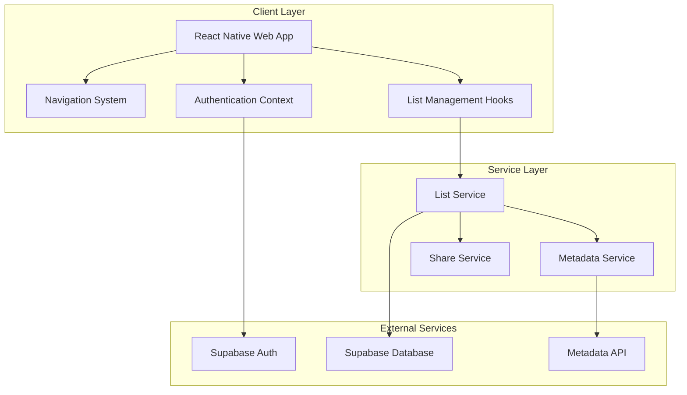
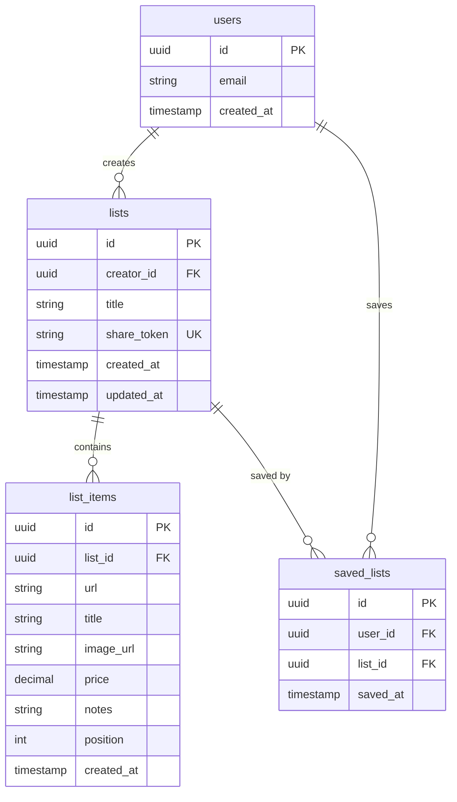

# Design Document: Christmas List Sharing

## Overview

This document outlines the architectural design for transforming the relationship tracker into a Christmas list sharing web application. The system enables users to create wish lists by pasting product URLs, share these lists via unique links, and allows recipients to save and manage multiple shared lists in a personal dashboard.

### Feature Summary
- **List Creation**: Users create lists and add items via product URLs with automatic metadata extraction
- **List Sharing**: Generate unique shareable links for each list
- **Public Viewing**: Anyone with a link can view lists without authentication
- **Personal Dashboard**: Authenticated users can save shared lists and view all saved lists in one place
- **Multi-List Management**: Users can create and manage multiple lists

### Design Goals
1. Seamless integration with existing Expo + React Navigation architecture
2. Leverage Supabase for authentication and PostgreSQL database
3. Maintain cross-platform compatibility (web primary, native optional)
4. Optimize for web deployment on Vercel
5. Implement URL metadata extraction without blocking UI
6. Ensure shareable links work without authentication

## Architecture

### System Boundaries



### Navigation Architecture

The app will be restructured to support the new Christmas list sharing flow:

```
RootNavigator
├── Auth Stack (unauthenticated)
│   ├── LoginScreen
│   ├── SignUpScreen
│   └── ForgotPasswordScreen
├── Public Stack (no auth required)
│   └── SharedListViewScreen (/:shareToken)
└── Main App Stack (authenticated)
    ├── TabNavigator
    │   ├── MyLists (replaces Home)
    │   ├── Dashboard (replaces Contacts)
    │   └── Settings
    ├── CreateListScreen
    ├── EditListScreen
    └── ListDetailScreen
```

**Key Routing Changes:**
- Replace Home tab with "My Lists" screen
- Replace Contacts tab with "Dashboard" screen (saved lists)
- Add public route for shared list viewing (no auth required)
- Add modal/stack screens for list creation and editing

### Database Schema

The existing Supabase PostgreSQL database will be extended with the following tables:



**Table Specifications:**

**`lists` table:**
- `id`: UUID primary key (auto-generated)
- `creator_id`: UUID foreign key → `auth.users.id`
- `title`: VARCHAR(255), not null
- `share_token`: VARCHAR(32), unique, indexed (for fast lookups)
- `created_at`: TIMESTAMP WITH TIME ZONE, default now()
- `updated_at`: TIMESTAMP WITH TIME ZONE, default now()

**`list_items` table:**
- `id`: UUID primary key
- `list_id`: UUID foreign key → `lists.id` (ON DELETE CASCADE)
- `url`: TEXT, not null
- `title`: VARCHAR(500), nullable
- `image_url`: TEXT, nullable
- `price`: DECIMAL(10,2), nullable
- `notes`: TEXT, nullable
- `position`: INTEGER, not null (for ordering items)
- `created_at`: TIMESTAMP WITH TIME ZONE

**`saved_lists` table:**
- `id`: UUID primary key
- `user_id`: UUID foreign key → `auth.users.id` (ON DELETE CASCADE)
- `list_id`: UUID foreign key → `lists.id` (ON DELETE CASCADE)
- `saved_at`: TIMESTAMP WITH TIME ZONE
- Unique constraint on (`user_id`, `list_id`) - prevent duplicate saves

**Indexes:**
- `lists.share_token` - Unique index for fast lookups
- `list_items.list_id` - For fetching all items in a list
- `saved_lists.user_id` - For dashboard queries
- `saved_lists.list_id` - For checking if a list is saved

## Components and Interfaces

### Screen Components

#### 1. MyListsScreen
**Purpose:** Display all lists created by the authenticated user

**Interface:**
```typescript
interface MyListsScreenProps {
  navigation: NavigationProp<MainStackParamList>;
}

interface ListSummary {
  id: string;
  title: string;
  itemCount: number;
  createdAt: string;
  shareToken: string;
}
```

**Key Features:**
- FlatList of user's created lists
- Each list item shows title, item count, creation date
- "Create New List" button
- Navigation to EditListScreen or ListDetailScreen
- Delete list functionality with confirmation

#### 2. DashboardScreen
**Purpose:** Display all lists saved by the user from others

**Interface:**
```typescript
interface DashboardScreenProps {
  navigation: NavigationProp<MainStackParamList>;
}

interface SavedListSummary {
  id: string;
  title: string;
  creatorName: string;
  itemCount: number;
  savedAt: string;
  shareToken: string;
}
```

**Key Features:**
- FlatList of saved lists
- Show creator name, list title, item count
- Navigation to SharedListViewScreen
- Unsave/remove functionality

#### 3. CreateListScreen
**Purpose:** Create a new Christmas list

**Interface:**
```typescript
interface CreateListScreenProps {
  navigation: NavigationProp<MainStackParamList>;
}

interface CreateListForm {
  title: string;
}
```

**Flow:**
1. User enters list title
2. Submit creates list in database
3. Navigate to EditListScreen with new list ID

#### 4. EditListScreen
**Purpose:** Add, edit, remove items from a list

**Interface:**
```typescript
interface EditListScreenProps {
  route: RouteProp<MainStackParamList, 'EditList'>;
  navigation: NavigationProp<MainStackParamList>;
}

interface RouteParams {
  listId: string;
}

interface ListItem {
  id: string;
  url: string;
  title: string | null;
  imageUrl: string | null;
  price: number | null;
  notes: string | null;
  position: number;
}
```

**Key Features:**
- URL input field with "Add Item" button
- Loading state during metadata extraction
- Editable list of items (drag to reorder)
- Edit item details (title, notes, price)
- Delete item functionality
- "Generate Share Link" button
- Display shareable link with copy functionality

#### 5. ListDetailScreen
**Purpose:** Read-only view of user's own list

**Interface:**
```typescript
interface ListDetailScreenProps {
  route: RouteProp<MainStackParamList, 'ListDetail'>;
  navigation: NavigationProp<MainStackParamList>;
}

interface RouteParams {
  listId: string;
}
```

**Key Features:**
- Display list title and all items
- Show share link with copy button
- Edit button → navigate to EditListScreen
- Similar layout to SharedListViewScreen but with edit controls

#### 6. SharedListViewScreen
**Purpose:** Public view of a shared list (accessible via share token)

**Interface:**
```typescript
interface SharedListViewScreenProps {
  route: RouteProp<PublicStackParamList, 'SharedListView'>;
  navigation: NavigationProp<PublicStackParamList>;
}

interface RouteParams {
  shareToken: string;
}

interface SharedList {
  id: string;
  title: string;
  creatorName: string;
  items: ListItem[];
}
```

**Key Features:**
- Public access (no auth required)
- Display list title and creator name
- Show all items with images, titles, prices
- Clickable links open in new tab
- "Save to My Dashboard" button (prompts auth if needed)
- Check if already saved (show "Saved" state)

### Service Layer

#### ListService (`src/services/listService.ts`)

**Purpose:** Handle all list and list item CRUD operations

```typescript
interface ListService {
  // List operations
  createList(userId: string, title: string): Promise<List>;
  getUserLists(userId: string): Promise<ListSummary[]>;
  getListById(listId: string): Promise<List | null>;
  getListByShareToken(shareToken: string): Promise<SharedList | null>;
  updateListTitle(listId: string, title: string): Promise<void>;
  deleteList(listId: string): Promise<void>;

  // List item operations
  addItem(listId: string, url: string): Promise<ListItem>;
  updateItem(itemId: string, updates: Partial<ListItem>): Promise<void>;
  deleteItem(itemId: string): Promise<void>;
  reorderItems(listId: string, itemIds: string[]): Promise<void>;
  getListItems(listId: string): Promise<ListItem[]>;

  // Sharing operations
  generateShareToken(listId: string): Promise<string>;

  // Saved lists operations
  saveList(userId: string, listId: string): Promise<void>;
  unsaveList(userId: string, listId: string): Promise<void>;
  getSavedLists(userId: string): Promise<SavedListSummary[]>;
  isListSaved(userId: string, listId: string): Promise<boolean>;
}
```

**Implementation Details:**
- Uses Supabase client for database queries
- Generates random 32-character share tokens using crypto
- Handles cascading deletes through foreign keys
- Includes error handling for all operations

#### MetadataService (`src/services/metadataService.ts`)

**Purpose:** Extract product metadata from URLs

```typescript
interface MetadataService {
  extractMetadata(url: string): Promise<ProductMetadata>;
}

interface ProductMetadata {
  title: string | null;
  imageUrl: string | null;
  price: number | null;
  description: string | null;
  success: boolean;
}
```

**Implementation Strategy:**

**Option 1: Open Graph Protocol (Recommended)**
- Fetch HTML from URL
- Parse Open Graph meta tags: `og:title`, `og:image`, `og:description`
- Parse price from structured data (schema.org)
- Lightweight, works for most e-commerce sites

**Option 2: Third-Party API**
- Use services like LinkPreview, Microlink, or URLBox
- More reliable but requires API key and may have costs
- Better for production use

**Implementation (Option 1):**
```typescript
async function extractMetadata(url: string): Promise<ProductMetadata> {
  try {
    const response = await fetch(url);
    const html = await response.text();

    // Parse Open Graph tags
    const title = extractOGTag(html, 'og:title');
    const imageUrl = extractOGTag(html, 'og:image');
    const description = extractOGTag(html, 'og:description');

    // Try to extract price from structured data
    const price = extractPrice(html);

    return {
      title,
      imageUrl,
      price,
      description,
      success: true
    };
  } catch (error) {
    return {
      title: null,
      imageUrl: null,
      price: null,
      description: null,
      success: false
    };
  }
}
```

**Considerations:**
- CORS issues may require proxy or serverless function
- Create Vercel API endpoint: `/api/extract-metadata`
- Cache results to avoid repeated fetches
- Timeout after 5 seconds to prevent hanging
- Fallback to manual entry on failure

### Custom Hooks

#### useList Hook

```typescript
interface UseListReturn {
  list: List | null;
  items: ListItem[];
  loading: boolean;
  error: string | null;

  createList: (title: string) => Promise<string>;
  updateTitle: (title: string) => Promise<void>;
  deleteList: () => Promise<void>;

  addItem: (url: string) => Promise<void>;
  updateItem: (itemId: string, updates: Partial<ListItem>) => Promise<void>;
  deleteItem: (itemId: string) => Promise<void>;
  reorderItems: (itemIds: string[]) => Promise<void>;

  generateShareLink: () => Promise<string>;
}

function useList(listId?: string): UseListReturn;
```

#### useSavedLists Hook

```typescript
interface UseSavedListsReturn {
  savedLists: SavedListSummary[];
  loading: boolean;
  error: string | null;

  saveList: (listId: string) => Promise<void>;
  unsaveList: (listId: string) => Promise<void>;
  isListSaved: (listId: string) => boolean;
  refresh: () => Promise<void>;
}

function useSavedLists(): UseSavedListsReturn;
```

#### useMetadata Hook

```typescript
interface UseMetadataReturn {
  extractMetadata: (url: string) => Promise<ProductMetadata>;
  loading: boolean;
  error: string | null;
}

function useMetadata(): UseMetadataReturn;
```

### Navigation Types

**Update `src/types/navigation.ts`:**

```typescript
export type PublicStackParamList = {
  SharedListView: { shareToken: string };
};

export type AuthStackParamList = {
  Login: undefined;
  SignUp: undefined;
  ForgotPassword: undefined;
};

export type RootTabParamList = {
  MyLists: undefined;
  Dashboard: undefined;
  Settings: undefined;
};

export type MainStackParamList = {
  Tabs: NavigatorScreenParams<RootTabParamList>;
  CreateList: undefined;
  EditList: { listId: string };
  ListDetail: { listId: string };
};

export type RootNavigatorParamList = {
  Auth: NavigatorScreenParams<AuthStackParamList>;
  Main: NavigatorScreenParams<MainStackParamList>;
  Public: NavigatorScreenParams<PublicStackParamList>;
};
```

## Data Models

### TypeScript Interfaces

**Create `src/types/list-models.ts`:**

```typescript
export interface List {
  id: string;
  creatorId: string;
  title: string;
  shareToken: string;
  createdAt: string;
  updatedAt: string;
}

export interface ListItem {
  id: string;
  listId: string;
  url: string;
  title: string | null;
  imageUrl: string | null;
  price: number | null;
  notes: string | null;
  position: number;
  createdAt: string;
}

export interface ListSummary {
  id: string;
  title: string;
  itemCount: number;
  createdAt: string;
  shareToken: string;
}

export interface SavedListSummary {
  id: string;
  title: string;
  creatorName: string;
  itemCount: number;
  savedAt: string;
  shareToken: string;
}

export interface SharedList {
  id: string;
  title: string;
  creatorName: string;
  items: ListItem[];
}

export interface ProductMetadata {
  title: string | null;
  imageUrl: string | null;
  price: number | null;
  description: string | null;
  success: boolean;
}
```

## Error Handling

### Error Types

```typescript
export enum ListErrorType {
  LIST_NOT_FOUND = 'LIST_NOT_FOUND',
  UNAUTHORIZED = 'UNAUTHORIZED',
  INVALID_URL = 'INVALID_URL',
  METADATA_EXTRACTION_FAILED = 'METADATA_EXTRACTION_FAILED',
  DATABASE_ERROR = 'DATABASE_ERROR',
  NETWORK_ERROR = 'NETWORK_ERROR',
}

export class ListError extends Error {
  type: ListErrorType;

  constructor(type: ListErrorType, message: string) {
    super(message);
    this.type = type;
    this.name = 'ListError';
  }
}
```

### Error Handling Strategy

1. **Service Layer Errors:**
   - Catch and wrap Supabase errors
   - Return typed ListError instances
   - Log errors for debugging

2. **UI Layer Errors:**
   - Display user-friendly messages
   - Use ErrorMessage component
   - Provide retry mechanisms

3. **Metadata Extraction Errors:**
   - Fail gracefully
   - Allow manual metadata entry
   - Don't block item creation

4. **Network Errors:**
   - Show offline message
   - Retry with exponential backoff
   - Cache when possible

### User-Facing Error Messages

```typescript
export const LIST_ERROR_MESSAGES = {
  [ListErrorType.LIST_NOT_FOUND]: 'This list could not be found. It may have been deleted.',
  [ListErrorType.UNAUTHORIZED]: 'You do not have permission to perform this action.',
  [ListErrorType.INVALID_URL]: 'Please enter a valid URL.',
  [ListErrorType.METADATA_EXTRACTION_FAILED]: 'Could not load product details. You can add them manually.',
  [ListErrorType.DATABASE_ERROR]: 'Something went wrong. Please try again.',
  [ListErrorType.NETWORK_ERROR]: 'Network error. Please check your connection.',
};
```

## Testing Strategy

### Unit Tests

**Services:**
- `listService.test.ts` - Test all CRUD operations
  - Mock Supabase client
  - Test share token generation
  - Test error handling

- `metadataService.test.ts` - Test metadata extraction
  - Mock fetch responses
  - Test Open Graph parsing
  - Test error scenarios

**Hooks:**
- `useList.test.ts` - Test list management hook
  - Test loading states
  - Test CRUD operations
  - Test error handling

- `useSavedLists.test.ts` - Test saved lists hook
  - Test save/unsave operations
  - Test list filtering

### Integration Tests

**Screen Tests:**
- `MyListsScreen.test.tsx`
  - Render empty state
  - Render with lists
  - Test navigation to create/edit
  - Test delete functionality

- `EditListScreen.test.tsx`
  - Add item with URL
  - Edit item details
  - Reorder items
  - Generate share link

- `SharedListViewScreen.test.tsx`
  - Public access (no auth)
  - Display items correctly
  - Save to dashboard
  - Handle not found

**Navigation Tests:**
- Test public route access
- Test authenticated routes
- Test deep linking with share tokens

### End-to-End Tests (Manual)

**Flow 1: Create and Share List**
1. Sign up / Sign in
2. Create new list
3. Add 3-5 items via URLs
4. Generate share link
5. Copy link
6. Open link in incognito (verify public access)

**Flow 2: Save Shared List**
1. Receive shared list link
2. Open link (not logged in)
3. Click "Save to Dashboard"
4. Sign in / Sign up
5. Verify list appears in dashboard
6. Navigate to list from dashboard

**Flow 3: Manage Lists**
1. Create multiple lists
2. Edit list items
3. Delete items
4. Delete entire list
5. Verify share link is invalidated

## API Endpoints (Vercel Serverless)

### POST `/api/extract-metadata`

**Purpose:** Extract product metadata from URL (to avoid CORS issues)

**Request:**
```typescript
{
  url: string;
}
```

**Response:**
```typescript
{
  success: boolean;
  metadata?: {
    title: string | null;
    imageUrl: string | null;
    price: number | null;
    description: string | null;
  };
  error?: string;
}
```

**Implementation:**
```typescript
// api/extract-metadata.ts
import type { VercelRequest, VercelResponse } from '@vercel/node';

export default async function handler(req: VercelRequest, res: VercelResponse) {
  if (req.method !== 'POST') {
    return res.status(405).json({ error: 'Method not allowed' });
  }

  const { url } = req.body;

  if (!url || typeof url !== 'string') {
    return res.status(400).json({ error: 'Invalid URL' });
  }

  try {
    // Fetch HTML
    const response = await fetch(url, {
      headers: {
        'User-Agent': 'Mozilla/5.0 (compatible; ChristmasListBot/1.0)',
      },
      timeout: 5000,
    });

    const html = await response.text();

    // Extract metadata
    const metadata = {
      title: extractOGTag(html, 'og:title') || extractTag(html, 'title'),
      imageUrl: extractOGTag(html, 'og:image'),
      price: extractPrice(html),
      description: extractOGTag(html, 'og:description'),
    };

    return res.status(200).json({
      success: true,
      metadata,
    });
  } catch (error) {
    return res.status(500).json({
      success: false,
      error: 'Failed to extract metadata',
    });
  }
}

function extractOGTag(html: string, property: string): string | null {
  const regex = new RegExp(`<meta[^>]*property=["']${property}["'][^>]*content=["']([^"']*)["']`, 'i');
  const match = html.match(regex);
  return match ? match[1] : null;
}

function extractTag(html: string, tag: string): string | null {
  const regex = new RegExp(`<${tag}[^>]*>([^<]*)</${tag}>`, 'i');
  const match = html.match(regex);
  return match ? match[1] : null;
}

function extractPrice(html: string): number | null {
  // Look for schema.org price
  const schemaRegex = /"price"\s*:\s*"?(\d+\.?\d*)"?/i;
  const match = html.match(schemaRegex);
  return match ? parseFloat(match[1]) : null;
}
```

## UI/UX Design Patterns

### Design System Integration

Use existing theme from `src/styles/theme.ts`:

**Colors:**
- Primary actions: `theme.colors.primary` (#007AFF)
- Backgrounds: `theme.colors.background` (#F2F2F7)
- Cards: `theme.colors.cardBackground` (#FFFFFF)
- Text: `theme.colors.text` (#000000)
- Secondary text: `theme.colors.textSecondary` (#8E8E93)

**Components:**
- Lists: Use `FlatList` with `theme.spacing.md` gaps
- Cards: Border radius `theme.borderRadius.lg`, shadow for elevation
- Buttons: iOS-styled with `theme.colors.primary`
- Input fields: Rounded corners, focus states

### Responsive Layout

**Web Optimization:**
- Max width: 1200px for large screens
- Center content for desktop
- Use responsive grid for list items (2-3 columns on desktop)
- Touch-friendly tap targets (min 44x44 points)

### Loading States

**Skeleton Screens:**
- Show skeleton cards while loading lists
- Animate placeholder content
- Use `LoadingIndicator` for full-screen loads

**Optimistic Updates:**
- Add item immediately to UI
- Show loading state for metadata
- Update with metadata when fetched
- Rollback on error

### Empty States

**My Lists (empty):**
- Illustration or icon
- "You haven't created any lists yet"
- "Create your first Christmas list" CTA button

**Dashboard (empty):**
- "No saved lists yet"
- "When someone shares a list with you, you can save it here"

**Shared List (not found):**
- "This list doesn't exist or has been removed"
- Link to sign in / create account

## Security Considerations

### Row Level Security (RLS)

**Supabase RLS Policies:**

```sql
-- Lists table
-- Users can read their own lists
CREATE POLICY "Users can view own lists"
  ON lists FOR SELECT
  USING (auth.uid() = creator_id);

-- Users can create lists
CREATE POLICY "Users can create lists"
  ON lists FOR INSERT
  WITH CHECK (auth.uid() = creator_id);

-- Users can update their own lists
CREATE POLICY "Users can update own lists"
  ON lists FOR UPDATE
  USING (auth.uid() = creator_id);

-- Users can delete their own lists
CREATE POLICY "Users can delete own lists"
  ON lists FOR DELETE
  USING (auth.uid() = creator_id);

-- Anyone can read lists by share_token (for public sharing)
CREATE POLICY "Anyone can view lists by share token"
  ON lists FOR SELECT
  USING (true);

-- List items table
-- Users can manage items in their lists
CREATE POLICY "Users can manage own list items"
  ON list_items
  USING (
    EXISTS (
      SELECT 1 FROM lists
      WHERE lists.id = list_items.list_id
      AND lists.creator_id = auth.uid()
    )
  );

-- Anyone can read list items for public sharing
CREATE POLICY "Anyone can view list items"
  ON list_items FOR SELECT
  USING (true);

-- Saved lists table
-- Users can manage their saved lists
CREATE POLICY "Users can manage own saved lists"
  ON saved_lists
  USING (auth.uid() = user_id);
```

### Share Token Security

- Generate cryptographically random tokens (32 chars)
- Use `crypto.randomBytes()` for generation
- Index for fast lookups without exposing sequential IDs
- No sensitive data exposed through share links

### Input Validation

**URL Validation:**
```typescript
function isValidUrl(url: string): boolean {
  try {
    const parsed = new URL(url);
    return parsed.protocol === 'http:' || parsed.protocol === 'https:';
  } catch {
    return false;
  }
}
```

**XSS Prevention:**
- Sanitize user-provided text (titles, notes)
- Use React's built-in XSS protection
- Don't render raw HTML from metadata

## Performance Optimizations

### Database Queries

**Optimized Queries:**
- Use joins to fetch list + items in single query
- Index on `share_token` for fast public lookups
- Paginate long lists (virtualize on mobile)

**Example Optimized Query:**
```sql
SELECT
  l.id, l.title, l.creator_id, l.share_token,
  u.email as creator_email,
  json_agg(
    json_build_object(
      'id', li.id,
      'url', li.url,
      'title', li.title,
      'imageUrl', li.image_url,
      'price', li.price,
      'notes', li.notes,
      'position', li.position
    ) ORDER BY li.position
  ) as items
FROM lists l
LEFT JOIN list_items li ON li.list_id = l.id
JOIN auth.users u ON u.id = l.creator_id
WHERE l.share_token = $1
GROUP BY l.id, u.email;
```

### Image Optimization

- Lazy load images in lists
- Use placeholder while loading
- Cache images in browser
- Consider using image CDN for production

### Metadata Extraction

- Non-blocking: Extract in background
- Cache results in database (avoid re-fetching)
- Timeout after 5 seconds
- Queue for batch processing if many URLs added

## Migration Strategy

### Phase 1: Database Setup
1. Create Supabase tables (`lists`, `list_items`, `saved_lists`)
2. Set up RLS policies
3. Create indexes
4. Test with sample data

### Phase 2: Service Layer
1. Implement `listService.ts`
2. Implement `metadataService.ts`
3. Create API endpoint `/api/extract-metadata`
4. Unit test all services

### Phase 3: Navigation & Screens
1. Update navigation types
2. Implement screen components (empty states first)
3. Update RootNavigator routing
4. Test navigation flows

### Phase 4: Hooks & Integration
1. Implement custom hooks
2. Connect screens to services
3. Add loading/error states
4. Integration testing

### Phase 5: Polish & Deploy
1. UI polish (animations, feedback)
2. Error handling refinement
3. Performance testing
4. Deploy to Vercel
5. End-to-end testing

## Deployment Considerations

### Environment Variables

Add to `.env`:
```
EXPO_PUBLIC_SUPABASE_URL=https://xxx.supabase.co
EXPO_PUBLIC_SUPABASE_ANON_KEY=xxx
EXPO_PUBLIC_APP_URL=https://yourapp.vercel.app
```

### Vercel Configuration

Update `vercel.json`:
```json
{
  "rewrites": [
    { "source": "/list/:shareToken", "destination": "/index.html" },
    { "source": "/(.*)", "destination": "/index.html" }
  ]
}
```

### Deep Linking

Support URLs like: `https://yourapp.vercel.app/list/abc123`

**React Navigation Linking Config:**
```typescript
const linking = {
  prefixes: ['https://yourapp.vercel.app', 'yourapp://'],
  config: {
    screens: {
      Public: {
        screens: {
          SharedListView: 'list/:shareToken',
        },
      },
    },
  },
};
```

## Future Enhancements

### V2 Features (Out of Scope)
- Item claiming (mark as "purchased" without revealing to creator)
- Notifications when list is updated
- Price tracking (alert when price drops)
- Import from Amazon wishlist
- Collaborative lists (multiple creators)
- Categories/tags for items
- Priority levels for items
- Mobile app builds (iOS/Android)

### Scalability Considerations
- CDN for images
- Redis caching for frequently accessed lists
- Rate limiting on metadata extraction
- Background job processing for metadata
- Analytics and usage tracking

---

## Summary

This design leverages the existing Expo + React Native + Supabase architecture to build a complete Christmas list sharing platform. The modular service layer, type-safe interfaces, and clear separation of concerns ensure maintainability and scalability. The public sharing mechanism (via share tokens) combined with authenticated dashboard features provides a seamless user experience for both list creators and recipients.

Key technical decisions:
- **Supabase PostgreSQL** for persistent storage with RLS security
- **Share tokens** for public access without compromising security
- **Serverless metadata extraction** to avoid CORS and improve reliability
- **React Navigation** restructured for public + authenticated flows
- **Optimistic UI updates** for responsive user experience
- **Web-first design** optimized for Vercel deployment

The implementation follows React Native best practices, integrates seamlessly with existing infrastructure, and provides a solid foundation for future enhancements.