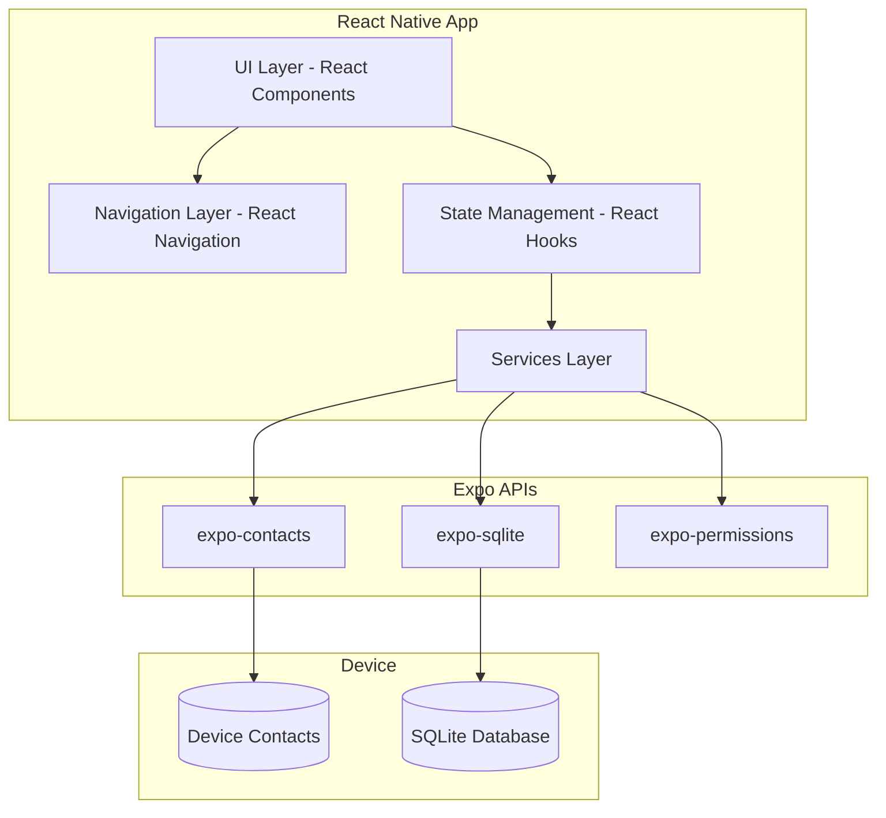
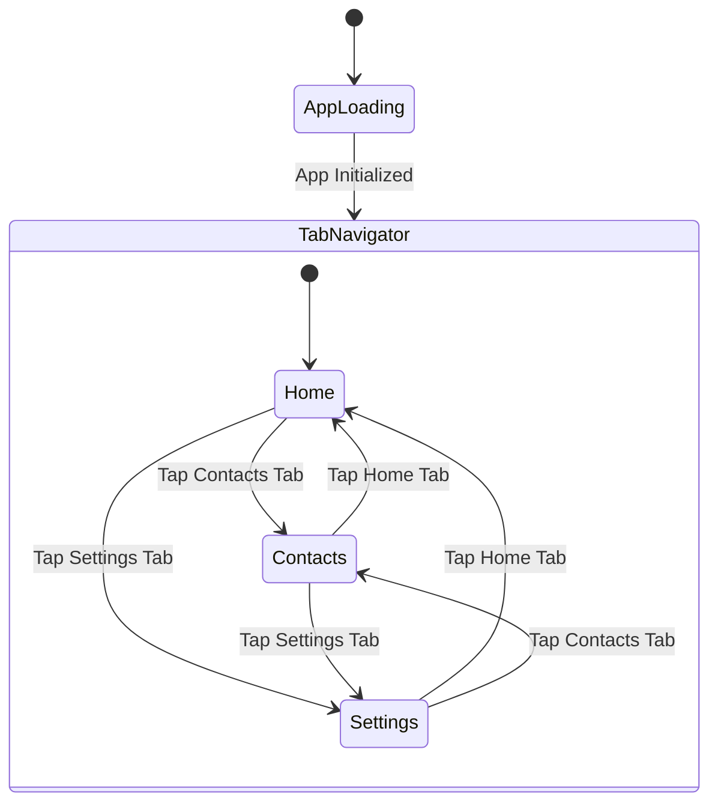
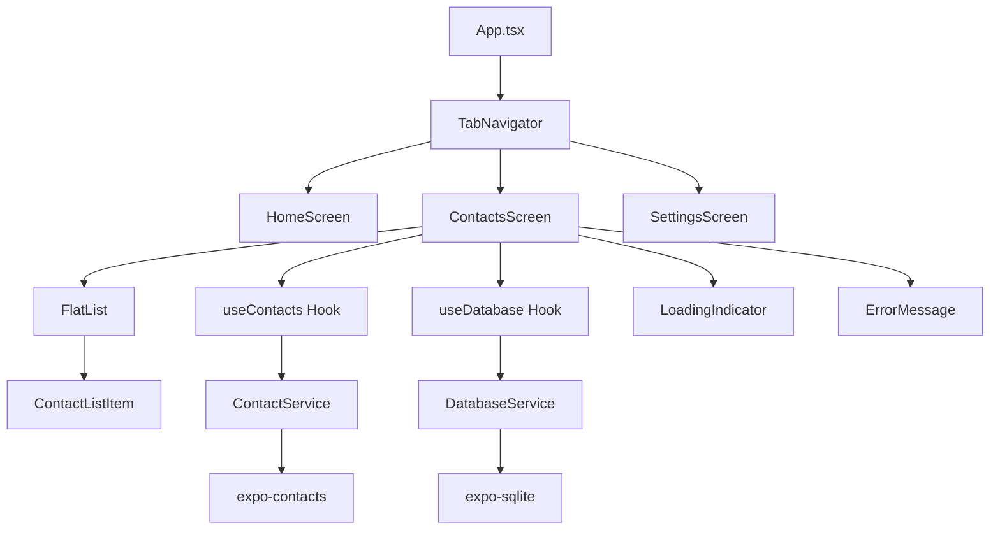
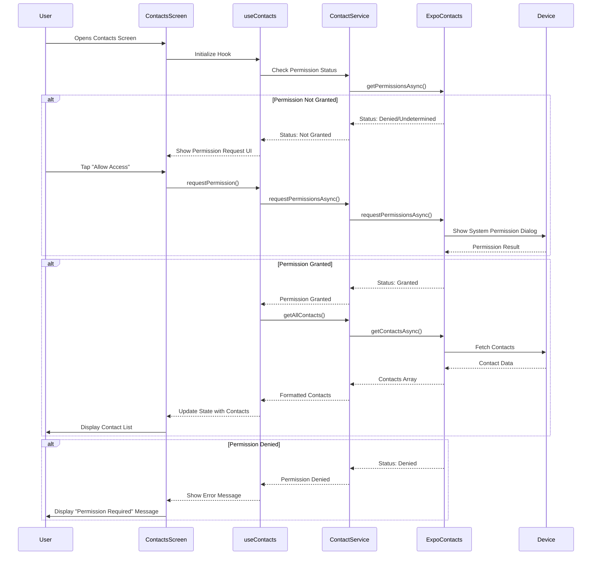
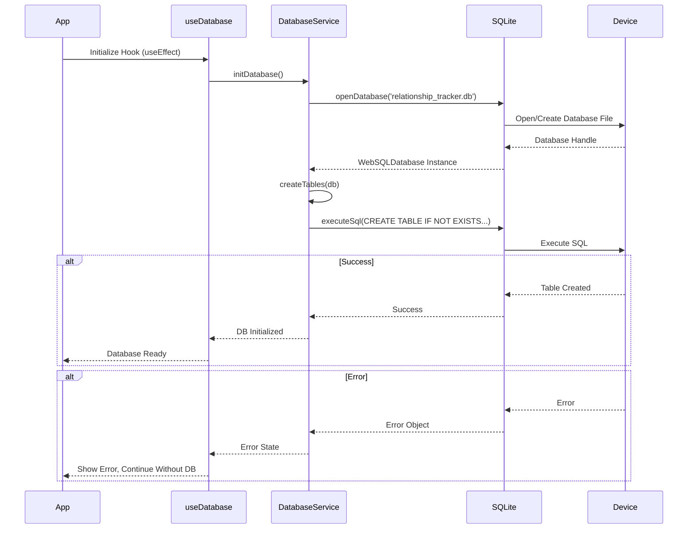

# Design Document

## Overview

The Relationship Tracker app is a React Native Expo application built with TypeScript that helps users maintain relationships by tracking communication with contacts. This design document outlines the architecture, components, data models, and implementation strategy for the foundational version of the app.

The app follows a standard React Native architecture with functional components, React hooks for state management, React Navigation for screen navigation, expo-contacts for device contact access, and expo-sqlite for local data persistence. The design prioritizes iOS user experience while maintaining cross-platform compatibility through Expo's managed workflow.

## Architecture

### System Boundaries



### Architecture Layers

1. **Presentation Layer** (Screens & Components)
   - Screen components: HomeScreen, ContactsScreen, SettingsScreen
   - Reusable UI components: ContactListItem, LoadingIndicator, ErrorMessage
   - Styling: iOS-optimized styles using StyleSheet

2. **Navigation Layer**
   - Bottom Tab Navigator (React Navigation)
   - Type-safe navigation with TypeScript
   - iOS-styled tab bar icons

3. **State Management Layer**
   - Local component state using useState
   - Side effects using useEffect
   - Custom hooks for reusable logic (useContacts, useDatabase)

4. **Services Layer**
   - ContactService: handles contact retrieval and permission requests
   - DatabaseService: manages SQLite operations
   - Abstraction layer between UI and Expo APIs

5. **Data Persistence Layer**
   - SQLite database for interaction tracking
   - Local-first architecture (no backend required)

## Components and Interfaces

### Screen Components

#### HomeScreen
```typescript
interface HomeScreenProps {
  navigation: NavigationProp<RootTabParamList, 'Home'>;
}

// Purpose: Dashboard showing overview and quick actions
// State: none initially (future: summary statistics)
// Displays: Welcome message, app description, navigation hints
```

#### ContactsScreen
```typescript
interface ContactsScreenProps {
  navigation: NavigationProp<RootTabParamList, 'Contacts'>;
}

interface ContactsScreenState {
  contacts: Contact[];
  loading: boolean;
  error: string | null;
  permissionStatus: PermissionStatus;
}

// Purpose: Display list of device contacts with interaction tracking
// Uses: useContacts hook
// Handles: Permission requests, contact loading, error states
```

#### SettingsScreen
```typescript
interface SettingsScreenProps {
  navigation: NavigationProp<RootTabParamList, 'Settings'>;
}

// Purpose: App settings and preferences (minimal in v1)
// Displays: App version, future settings placeholder
```

### Reusable Components

#### ContactListItem
```typescript
interface ContactListItemProps {
  contact: Contact;
  lastContacted?: Date | null;
  onPress?: () => void;
}

// Purpose: Render individual contact in FlatList
// Displays: Name, phone number, last contacted date (placeholder)
// Style: iOS-optimized with subtle borders and spacing
```

#### LoadingIndicator
```typescript
interface LoadingIndicatorProps {
  message?: string;
}

// Purpose: Show loading state with optional message
// Uses: ActivityIndicator from React Native
```

#### ErrorMessage
```typescript
interface ErrorMessageProps {
  message: string;
  onRetry?: () => void;
}

// Purpose: Display user-friendly error messages
// Optional: Retry button for recoverable errors
```

### Custom Hooks

#### useContacts
```typescript
interface UseContactsReturn {
  contacts: Contact[];
  loading: boolean;
  error: string | null;
  requestPermission: () => Promise<void>;
  loadContacts: () => Promise<void>;
  permissionStatus: PermissionStatus;
}

function useContacts(): UseContactsReturn;

// Purpose: Encapsulate contact loading logic and permission handling
// Manages: Permission state, contact retrieval, error handling
// Side effects: Requests permissions, fetches contacts on mount
```

#### useDatabase
```typescript
interface UseDatabaseReturn {
  db: SQLite.WebSQLDatabase | null;
  initialized: boolean;
  error: string | null;
}

function useDatabase(): UseDatabaseReturn;

// Purpose: Initialize and provide access to SQLite database
// Manages: Database connection, table creation, initialization state
// Side effects: Creates database and tables on mount
```

### Service Interfaces

#### ContactService
```typescript
interface ContactService {
  requestPermission(): Promise<PermissionResponse>;
  getPermissionStatus(): Promise<PermissionStatus>;
  getAllContacts(): Promise<Contact[]>;
}

// Methods:
// - requestPermission: Request contact access from user
// - getPermissionStatus: Check current permission state
// - getAllContacts: Retrieve all device contacts (requires permission)
```

#### DatabaseService
```typescript
interface DatabaseService {
  initDatabase(): Promise<SQLite.WebSQLDatabase>;
  createTables(db: SQLite.WebSQLDatabase): Promise<void>;
  saveInteraction(contactId: string, date: Date): Promise<void>;
  getLastInteraction(contactId: string): Promise<Date | null>;
}

// Methods:
// - initDatabase: Open or create SQLite database
// - createTables: Create schema for interaction tracking
// - saveInteraction: Record contact interaction with timestamp
// - getLastInteraction: Retrieve most recent interaction for contact
```

## Data Models

### Contact Model
```typescript
interface Contact {
  id: string;                    // Unique identifier from device
  name: string;                  // Display name (fallback: "Unknown Contact")
  phoneNumbers?: PhoneNumber[];  // Array of phone numbers
  imageAvailable?: boolean;      // Whether contact has image (future use)
}

interface PhoneNumber {
  number: string;
  type?: string;                 // e.g., "mobile", "home", "work"
  label?: string;
  id: string;
}
```

### Interaction Model (Database)
```sql
CREATE TABLE IF NOT EXISTS interactions (
  id INTEGER PRIMARY KEY AUTOINCREMENT,
  contact_id TEXT NOT NULL,
  interaction_date TEXT NOT NULL,  -- ISO 8601 format
  created_at TEXT DEFAULT CURRENT_TIMESTAMP,
  notes TEXT,                      -- Future: optional notes about interaction
  UNIQUE(contact_id, interaction_date)
);

CREATE INDEX idx_contact_id ON interactions(contact_id);
CREATE INDEX idx_interaction_date ON interactions(interaction_date);
```

TypeScript representation:
```typescript
interface Interaction {
  id: number;
  contactId: string;
  interactionDate: Date;
  createdAt: Date;
  notes?: string;
}
```

### Navigation Types
```typescript
type RootTabParamList = {
  Home: undefined;
  Contacts: undefined;
  Settings: undefined;
};

// Provides type-safe navigation throughout the app
```

### Permission Status
```typescript
enum PermissionStatus {
  UNDETERMINED = 'undetermined',
  GRANTED = 'granted',
  DENIED = 'denied',
}
```

## Project Structure

```
final_project/
├── .claude/
│   └── specs/
│       └── relationship-tracker/
│           ├── requirements.md
│           ├── design.md
│           └── tasks.md
├── app.json
├── package.json
├── tsconfig.json
├── App.tsx
├── src/
│   ├── navigation/
│   │   └── TabNavigator.tsx
│   ├── screens/
│   │   ├── HomeScreen.tsx
│   │   ├── ContactsScreen.tsx
│   │   └── SettingsScreen.tsx
│   ├── components/
│   │   ├── ContactListItem.tsx
│   │   ├── LoadingIndicator.tsx
│   │   └── ErrorMessage.tsx
│   ├── hooks/
│   │   ├── useContacts.ts
│   │   └── useDatabase.ts
│   ├── services/
│   │   ├── contactService.ts
│   │   └── databaseService.ts
│   ├── types/
│   │   ├── navigation.ts
│   │   └── models.ts
│   ├── styles/
│   │   └── theme.ts
│   └── utils/
│       └── constants.ts
└── assets/
    ├── icon.png
    └── splash.png
```

## Navigation Flow



## Component Hierarchy



## Contact Loading Flow



## Database Initialization Flow



## Error Handling

### Error Categories and Strategies

1. **Permission Errors**
   - Denied permission: Show friendly message explaining why access is needed, offer link to settings
   - Undetermined: Show request button
   - Error during request: Log error, show generic message

2. **Contact Loading Errors**
   - API failure: Catch error, display user-friendly message with retry option
   - Empty contact list: Show "No contacts found" message
   - Malformed data: Filter out invalid contacts, log warning

3. **Database Errors**
   - Initialization failure: Log error, disable interaction tracking features, show warning
   - Query errors: Log error, return null/empty results gracefully
   - Write errors: Log error, notify user that interaction wasn't saved

4. **Navigation Errors**
   - Type errors caught at compile time with TypeScript
   - Runtime navigation errors: Fallback to home screen

### Error Display Strategy

```typescript
// Standardized error messages
const ErrorMessages = {
  PERMISSION_DENIED: "We need access to your contacts to help you track interactions. Please enable permissions in Settings.",
  CONTACT_LOAD_FAILED: "Unable to load contacts. Please try again.",
  DATABASE_INIT_FAILED: "Database initialization failed. Some features may be limited.",
  UNKNOWN_ERROR: "Something went wrong. Please try again.",
};

// Error boundary for unexpected crashes (future enhancement)
```

## Testing Strategy

### Unit Testing
- **Services**: Test contactService and databaseService with mocked Expo APIs
- **Hooks**: Test useContacts and useDatabase with @testing-library/react-hooks
- **Components**: Test ContactListItem rendering with various props
- **Utilities**: Test any helper functions

### Integration Testing
- **Contact Flow**: Test permission request → contact loading → display pipeline
- **Database Flow**: Test database initialization → table creation → basic queries
- **Navigation**: Test navigation between screens

### Manual Testing Checklist
1. **Permissions**
   - [ ] Grant permission on first launch
   - [ ] Deny permission and verify error message
   - [ ] Revoke permission in settings and reopen app
   - [ ] Request permission again after denial

2. **Contact Display**
   - [ ] Verify contacts load and display correctly
   - [ ] Test with contact that has no phone number
   - [ ] Test with contact that has no name
   - [ ] Test with empty contact list
   - [ ] Verify scrolling works smoothly with many contacts

3. **Database**
   - [ ] Verify database creates on first launch
   - [ ] Verify app works after closing and reopening (persistence)
   - [ ] Test error handling when database fails

4. **Navigation**
   - [ ] Navigate between all tabs
   - [ ] Verify correct tab highlights
   - [ ] Test navigation bar appearance on iPhone with notch

5. **iOS Specific**
   - [ ] Test on iPhone with notch (safe area)
   - [ ] Test on older iPhone without notch
   - [ ] Verify status bar appearance
   - [ ] Test on different iOS versions (if possible)

### Testing Tools
- Jest: Unit testing framework
- @testing-library/react-native: Component testing
- @testing-library/react-hooks: Hook testing
- Expo Go app: Manual testing on device
- iOS Simulator: Testing on various device sizes

## Styling Guidelines

### Design Principles
1. **iOS Native Feel**: Use iOS-standard spacing, fonts, and interaction patterns
2. **Minimalism**: Clean, uncluttered interface with plenty of whitespace
3. **Accessibility**: Ensure sufficient color contrast and touch target sizes
4. **Consistency**: Reuse spacing, colors, and typography throughout

### Theme Configuration

```typescript
// src/styles/theme.ts
export const theme = {
  colors: {
    primary: '#007AFF',        // iOS blue
    background: '#FFFFFF',
    secondaryBackground: '#F2F2F7',
    text: '#000000',
    secondaryText: '#8E8E93',
    border: '#C6C6C8',
    error: '#FF3B30',
    success: '#34C759',
  },
  spacing: {
    xs: 4,
    sm: 8,
    md: 16,
    lg: 24,
    xl: 32,
  },
  typography: {
    title: {
      fontSize: 28,
      fontWeight: '700',
    },
    headline: {
      fontSize: 17,
      fontWeight: '600',
    },
    body: {
      fontSize: 17,
      fontWeight: '400',
    },
    caption: {
      fontSize: 13,
      fontWeight: '400',
    },
  },
  borderRadius: {
    sm: 8,
    md: 12,
    lg: 16,
  },
};
```

### Component-Specific Styles

**ContactListItem**:
- Height: 60-80px
- Horizontal padding: 16px
- Border bottom: 0.5px solid theme.colors.border
- Background: white with subtle press state
- Text hierarchy: Name (headline), Phone (caption/secondary)

**Tab Bar**:
- Use iOS default styling from React Navigation
- Bottom safe area handling
- Icon size: 24x24px

**Lists**:
- Use FlatList for performance
- Pull-to-refresh capability (future)
- Empty state styling

### Safe Area Handling

```typescript
import { SafeAreaProvider, SafeAreaView } from 'react-native-safe-area-context';

// Wrap app in SafeAreaProvider
// Use SafeAreaView in screens to handle notch/home indicator
```

## Dependencies

### Core Dependencies
```json
{
  "expo": "~51.0.0",
  "react": "18.2.0",
  "react-native": "0.74.0",
  "typescript": "^5.1.3"
}
```

### Navigation
```json
{
  "@react-navigation/native": "^6.1.9",
  "@react-navigation/bottom-tabs": "^6.5.11",
  "react-native-screens": "~3.31.1",
  "react-native-safe-area-context": "4.10.1"
}
```

### Expo APIs
```json
{
  "expo-contacts": "~13.0.0",
  "expo-sqlite": "~14.0.0"
}
```

### Development Dependencies
```json
{
  "@types/react": "~18.2.45",
  "@types/react-native": "^0.72.0",
  "@babel/core": "^7.20.0"
}
```

## Implementation Notes

### TypeScript Configuration
- Enable strict mode for type safety
- Use path aliases for clean imports (e.g., `@/components`)
- Define all types in dedicated type files

### Code Comments
- Every component should have a brief description comment
- Complex logic should be explained with inline comments
- Service methods should have JSDoc comments

### Performance Considerations
- Use FlatList for contact rendering (virtualization)
- Memoize ContactListItem with React.memo to prevent unnecessary re-renders
- Lazy load database operations
- Avoid heavy computations in render methods

### Future Enhancements (Out of Scope for v1)
- Contact search/filtering
- Sorting options (alphabetical, last contacted)
- Manual interaction logging
- Reminders/notifications
- Contact grouping
- Statistics dashboard on Home screen
- Settings for reminder frequency
- Contact images
- Dark mode support

## Security and Privacy

### Data Privacy
- All data stored locally on device
- No data transmitted to external servers
- Contact data only accessed with explicit user permission
- Database file stored in app's private directory

### Permission Handling
- Request minimum necessary permissions
- Clear explanation of why permissions are needed
- Graceful degradation if permissions denied
- Respect user's privacy choices

## Deployment Configuration

### app.json Configuration
```json
{
  "expo": {
    "name": "Relationship Tracker",
    "slug": "relationship-tracker",
    "version": "1.0.0",
    "orientation": "portrait",
    "icon": "./assets/icon.png",
    "userInterfaceStyle": "light",
    "splash": {
      "image": "./assets/splash.png",
      "resizeMode": "contain",
      "backgroundColor": "#ffffff"
    },
    "ios": {
      "supportsTablet": true,
      "bundleIdentifier": "com.yourname.relationshiptracker",
      "infoPlist": {
        "NSContactsUsageDescription": "This app needs access to your contacts to help you track when you last connected with friends and family."
      }
    },
    "plugins": [
      "expo-sqlite"
    ]
  }
}
```

### iOS Specific Considerations
- Add NSContactsUsageDescription to Info.plist (via app.json)
- Test on various iPhone screen sizes
- Ensure proper handling of safe areas (notch, home indicator)
- Test on both iOS simulator and physical device before deployment
